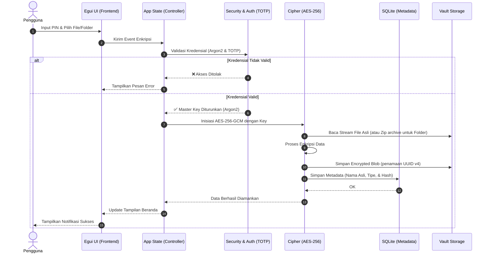

<div align="center">


[](https://git.io/typing-svg)

[](https://git.io/typing-svg)

**Akses Aman & Privasi Penuh untuk Data Anda**

<p align="center">
  <a href="https://www.rust-lang.org/"></a>
  <a href="https://github.com/emilk/egui"></a>
  <a href="#"></a>
  <a href="#"></a>
  <a href="#"></a>
</p>

*Brankas digital modern yang memadukan performa tangguh Rust dengan antarmuka memukau.*

**[📥 Unduh Rilis Terbaru](#) • [🚀 Cara Penggunaan](#-cara-penggunaan) • [🐛 Laporkan Bug](#)**

<br/>


</div>

---

<details open>
<summary><b>📑 Daftar Isi</b> <i>(Klik untuk ekspansi)</i></summary>

> | 🚀 **Pengenalan & Panduan** | ⚙️ **Teknis & Referensi** |
> | :--- | :--- |
> | 🌟 [**Tentang Proyek**](#-tentang-proyek) | 📂 [**Struktur Penyimpanan**](#-struktur-penyimpanan) |
> | ✨ [**Fitur Unggulan**](#-fitur-unggulan) | 🏗️ [**Architecture Workflow**](#️-architecture-workflow) |
> | 🚀 [**Panduan Memulai**](#-panduan-memulai-quick-start) | 🛠️ [**Teknologi Digunakan**](#️-teknologi-yang-digunakan) |
> | 📖 [**Cara Penggunaan**](#-cara-penggunaan) | 👥 [**Tim Pengembang**](#-tim-pengembang) |

</details>

---

## 🌟 Tentang Proyek

**DataVault (Aegis Vault)** adalah brankas digital lintas platform (Desktop & Android) yang dirancang untuk mengamankan privasi data Anda di level tertinggi. Dibangun murni menggunakan bahasa pemrograman **Rust** yang tangguh dipadukan dengan framework GUI **`egui`**, aplikasi ini menghadirkan performa secepat kilat dengan tingkat keamanan kelas militer.

DataVault tidak hanya sekadar mengenkripsi file, tetapi juga mendukung kompresi folder menyeluruh, sistem Autentikasi Dua Faktor (2FA), perlindungan keamanan per-folder.

> 💡 **Misi Kami:** Menyediakan *Brankas Digital Terpadu* yang menyeimbangkan antara keamanan kriptografi modern (Argon2 & AES-256) dengan pengalaman antarmuka pengguna (UX) yang memukau, responsif, dan mudah diakses baik dari perangkat Desktop maupun Mobile.

<div align="right">
  <a href="#-datavault-aegis-vault">⬆ Kembali ke Atas</a>
</div>

---

## ✨ Fitur Unggulan

| Fitur | Deskripsi |
| :---: | :--- |
| 🛡️ **Keamanan Kelas Militer** | Menggunakan standar enkripsi **AES-256** dan **PBKDF2-HMAC-SHA256** untuk mencegah serangan *brute-force*. |
| 🔑 **Sistem PIN Pintar** | Akses cepat dengan PIN 6-digit. PIN di-hash dengan aman dan tidak pernah disimpan dalam *plaintext*. |
| 🔒 **Integrasi TOTP (2FA)** | Dukungan Autentikasi Dua Faktor untuk perlindungan ganda pada brankas Anda. |
| ✅ **Validasi Integritas** | Hash **SHA-256** memastikan data Anda tidak pernah rusak atau dimodifikasi oleh pihak ketiga. |
| 🗄️ **Database Lokal Terpusat**| Manajemen metadata pintar menggunakan **SQLite**, memastikan sinkronisasi data yang cepat dan aman. |
| 🗑️ **Recycle Bin Aman** | Sistem pemulihan file cerdas dengan recycle bin internal yang terenkripsi. |
| 🚨 **Anti-Tampering & Deteksi Root** | Mencegah aplikasi berjalan di lingkungan yang tidak aman seperti Emulator atau perangkat Android yang telah di-root. |
| ⚡ **Panic Button & Auto-Lock** | Mengunci brankas secara otomatis saat tidak ada aktivitas atau melalui tombol pintas darurat (ESC). |
| 👁️ **In-App Media Preview** | Melihat dokumen dan media secara aman langsung di dalam brankas tanpa perlu mengekstraknya ke luar. |
| 📊 **Real-time System Monitoring**| Pantau penggunaan metrik perangkat (CPU, RAM, Disk, I/O) secara langsung dari dashboard. |
| 📝 **Audit Logs** | Mencatat setiap aktivitas krusial seperti proses login, enkripsi, dan dekripsi untuk transparansi keamanan. |
| 🎨 **Desain Modern** | Antarmuka pengguna *glassmorphism* yang elegan, responsif, dan memanjakan mata dengan **egui**. |

<div align="right">
  <a href="#-datavault-aegis-vault">⬆ Kembali ke Atas</a>
</div>

---

## 🚀 Panduan Memulai (Quick Start)

Amankan data Anda hanya dalam beberapa langkah mudah!

<details>
<summary><b>🛠️ 1. Persiapan Sistem</b> <i>(Klik untuk melihat instruksi)</i></summary>
<br>

Pastikan Anda sudah menginstal **Rust** dan **Cargo**.
- **Windows:** Unduh dan jalankan `rustup-init.exe` dari [rustup.rs](https://rustup.rs/).
- **Linux/macOS:** Jalankan perintah berikut di terminal:
  ```bash
  curl --proto '=https' --tlsv1.2 -sSf https://sh.rustup.rs | sh
  ```

</details>

<details>
<summary><b>📦 2. Kloning & Instalasi</b> <i>(Klik untuk melihat instruksi)</i></summary>
<br>

Buka terminal Anda dan jalankan perintah berikut:
```bash
git clone https://github.com/Anuvbis12/DataVault.git
cd DataVault

# Melakukan kompilasi awal (Opsional)
cargo build --release
```

</details>

### 3. Jalankan Aplikasi (Lintas Platform)

> [!IMPORTANT]
> **Wajib dijalankan dalam mode `--release`!** Operasi kriptografi kelas militer membutuhkan komputasi yang berat. Mode *release* menjamin aplikasi berjalan dengan lancar dan cepat.

**🖥️ Windows / macOS / Linux (Desktop):**
```bash
cargo run --release
```

**🤖 Android (Native):**
Pastikan tool `cargo-apk` sudah terinstal (`cargo install cargo-apk`), dan perangkat Android terhubung via USB Debugging.
```bash
cargo apk run --lib --release
```
> *Catatan: Menjalankan di Android memerlukan Android NDK dan SDK yang telah terkonfigurasi pada `ANDROID_HOME` & `ANDROID_NDK_ROOT`.*

<div align="right">
  <a href="#-datavault-aegis-vault">⬆ Kembali ke Atas</a>
</div>

---

## 📖 Cara Penggunaan

1. **Setup Awal 🔐**
   Saat pertama kali dijalankan, buat **PIN 6-digit** Anda. Ini adalah kunci utama ke brankas Anda. *Jangan sampai lupa!*
2. **Setup TOTP (2FA) 📱**
   Scan QR Code yang muncul di layar dengan aplikasi Authenticator (Google Authenticator / Authy) Anda untuk lapisan keamanan ganda.
3. **Amankan File ➕**
   Klik ikon tambah (+), lalu pilih dokumen, foto, atau video yang ingin disembunyikan. File akan dienkripsi secara otomatis.
4. **Pulihkan Data 🔓**
   Klik ikon gembok pada file di dalam brankas, pilih lokasi penyimpanan tujuan, dan file Anda akan kembali ke format aslinya.

<div align="right">
  <a href="#-datavault-aegis-vault">⬆ Kembali ke Atas</a>
</div>

---

## 📂 Struktur Penyimpanan

DataVault mengelola file Anda dengan rapi dan aman di dalam direktori `vault_storage/`:

<details>
<summary><b>📂 Tampilkan Pohon Direktori</b></summary>
<br>

```text
📦 DataVault
 ┣ 📂 src/                  # Source code aplikasi
 ┣ 📂 vault_storage/        # ⚠️ AREA TERENKRIPSI (JANGAN DIUBAH)
 ┃  ┣ 📜 vault.db           # Database metadata SQLite
 ┃  ┗ 📜 <uuid_file>        # File terenkripsi Anda
 ┗ 📜 Cargo.toml
```

</details>

> [!CAUTION]
> **DILARANG KERAS** mengubah, menghapus, atau memindahkan file di dalam `vault_storage/` secara manual melalui File Explorer. Hal ini dapat menyebabkan kerusakan database dan kehilangan data permanen!

<div align="right">
  <a href="#-datavault-aegis-vault">⬆ Kembali ke Atas</a>
</div>

---

## 🏗️ Architecture Workflow

Berikut adalah alur kerja sistem keamanan **DataVault** dari sisi pengguna hingga ke penyimpanan:



<div align="right">
  <a href="#-datavault-aegis-vault">⬆ Kembali ke Atas</a>
</div>

---

## 🛠️ Teknologi yang Digunakan

Aplikasi ini didukung oleh ekosistem Rust yang luar biasa:

* **[egui](https://github.com/emilk/egui)** & **[eframe](https://github.com/emilk/egui/tree/master/crates/eframe)**: Framework GUI *Immediate Mode* yang cepat dan integrasi windowing lintas platform (Desktop & Android).
* **[RustCrypto](https://github.com/RustCrypto)**: Implementasi murni Rust untuk algoritma kriptografi (`aes`, `argon2`, `hmac`, `sha2`).
* **[rusqlite](https://github.com/rusqlite/rusqlite)**: Binding aman untuk manajemen metadata via SQLite.
* **[rfd](https://github.com/PolyMeilex/rfd)**: Dialog file *native* untuk platform Desktop.
* **[zip](https://github.com/zip-rs/zip)**: Utilitas kompresi folder secara *on-the-fly* sebelum dienkripsi.
* **Custom TOTP (2FA)**: Menggunakan `sha1`, `data-encoding`, dan `qrcode` untuk implementasi 2FA yang ringan tanpa *library* eksternal besar.
* **Android Native Integrations**: Menggunakan `android-activity` dan `jni` untuk dukungan *native* pada Android (Lifecycle, Storage Permissions).

<div align="right">
  <a href="#-datavault-aegis-vault">⬆ Kembali ke Atas</a>
</div>

---

## 👥 Tim Pengembang

Proyek ini dikembangkan dengan dedikasi oleh:

<div align="center">

| Foto | Nama Lengkap | NIM |
| :---: | :--- | :--- |
|  | **Rizma Indra Pramudya** | `25051204370` |
|  | **Izora Elverda Narulita Putri** | `25051204287` |
|  | **Putera Al Khalidi** | `25051204362` |
|  | **Muhammad Abdullah Ro'in** | `25051204270` |

</div>

---

<div align="center">
  
  <p><b>Dibuat dengan ❤️ dan 🦀 (Rust) | Open Source</b></p>
</div>
